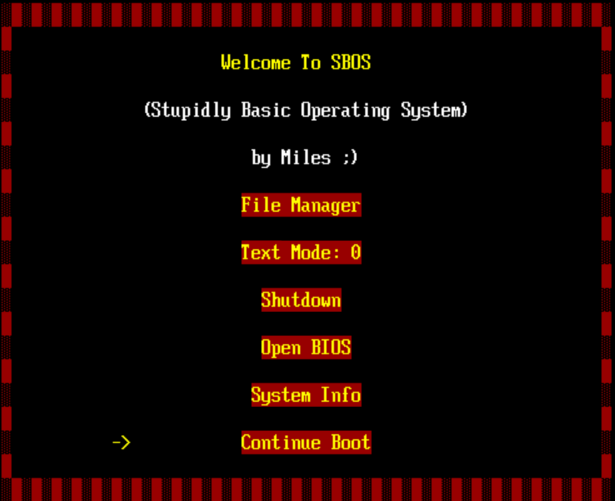
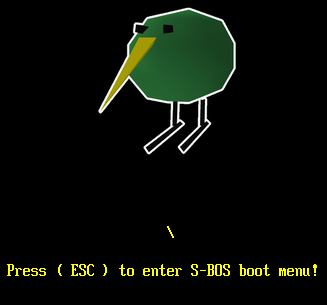

## S-BOS

### Stupidly Basic Operating System

This is a basic operating system that I made, at the moment it is not much more than a EFI program with some boot loader fetures. As of current is has a basic file system as well as some options to shut down, boot to bios or change the text mode.

This is the Boot menu of the OS:



This is the loading screen that you can see as the os is booting up, It uses GOP to render the BMP image found in the EFI partision of the disk:



### Dependancys

The dependancys for this project are:

```plaintext
qemu
mingw64-gcc
```

### Credit

This project is heavily ins[pired by a tutorial serise from [Queso Fuego](https://www.youtube.com/playlist?list=PLT7NbkyNWaqZYHNLtOZ1MNxOt8myP5K0p) on yt. I tried not to copy it directly, but parts of the project like the write_gpt are strait copys from his project.

A large potion of this project was also done through the use of the [UEFI docs](https://uefi.org/specs/UEFI/2.11/) and so that is an important source of knolage. If anybody would like to learn about UEFI OS Development i would highly recommend using both the sources mentioned here.
